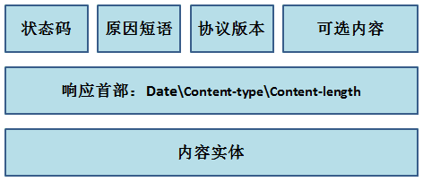

全面理解HTTP
===========


## URL和URI

我们	经常接触到URL了，它就是我们访问Web的一个字符串地址，那么URI是什么呢？他们是设么关系呢？

*	URL：uniform resource location 统一资源定位符
*	URI：uniform resource identifier 统一资源标识符

这也就是说，URI是一种资源的标识；而URL也是一种URI，也是一种资源的标识，但它也指明了如何定位locate到这个资源。

URI是一种抽象的资源标识，**既可以是绝对，也可以是相对的**。但是URL是一种URI，它致命了定位的信息，必须是绝对的。

## 报文-通信的桥梁

客户端和服务端通过相互发送**报文**进行通信，要深刻理解HTTP协议，就需要理解报文的格式和内容。

## 报文的组成


无论是请求报文还是相应报文都需要报文首部，当然报文主体并不是必须的。

一般来说，请求报文的格式如下：


看一下百度网站的请求报文：


简单的报文形式：

```

GET / HTTP/1.1    //请求行，包含用于请求的方法，请求的URI，HTTP版本
//以下为各种首部字段
Host: www.baidu.com
Connection: keep-alive
Upgrade-Insecure-Requests: 1
User-Agent: Mozilla/5.0...
Accept-Encoding: gzip, deflate, sdch
Accept-Language: zh-CN,zh;q=0.8

```

响应式的格式如下：



看一下百度网站的相应报文：


```

HTTP/1.1 200 OK   //状态行，包含表明响应结果的状态码，原因短语和HTTP版本
//以下为各种首部字段
Server: bfe/1.0.8.5
Date: Tue, 06 Oct 2015 14:48:28 GMT
Content-Type: text/html;charset=utf-8
Transfer-Encoding: chunked
Connection: keep-alive
Cache-Control: private

```

## 告知服务器意图的HTTP方法

发送HTTP的方法有许多种，最常用的便是GET和POST，下面就这两种进行详细地说明。

1.	GET

GET方法用来请求访问URI所指定的资源，（我访问你的某个资源）并不对服务器上的内容产生任何作用结果；每次GET的内容都是相同的。GET方式把请求所需要的参数放到`URL`中，直接就可以再URL中看见，有大小限制。

2.	POST

POST方法用来传输实体主体，目的并不是获取相应的主题内容，（**我要把这条信息告诉你**），POST方式则把内容放在`报文内容`中，因此只要报文的内容没有限制，它的大小就没有限制。

3.	总结

GET用于获取某个内容，POST用于提交某种数据请求。

按照使用场景来说。一般用户注册的内容术语私密的，这应该使用POST方式；而针对某一内容的查询，为了快速响应，可以使用GET方式。

## 无状态协议与Cookie

http是一种无状态协议，也就是每一次发送都是一次新的开始，服务器并不知道也没有必要知道当前连接的客户端是否之前有过交集，那么当需要进行保存用户登录状态时，则出现了麻烦，这个时候使用cookie来保存状态。

cookie会根据服务器端发送的相应报文内的一个叫做set-cookie的首部字段，通知客户端保存cookie（保存在自己的电脑里），当下次客户端发送请求，cookie值会被添加到请求文中发送出去。

## 持久连接

使用浏览器浏览一个包含多张图片的HTML网页，浏览器会发起多次请求，如下图所示：


显而易见每次请求会造成所谓的TCP连接建立和断开，增加通信量的开销。

## 引入持久连接

持久连接的特点是，只要任意一段没有明确提出断开连接，则保持TCP连接状态。目前HTTP/1.1中默认为持久连接。

```

Connection:keep-alive

```


## 管线化

管线化可以同时并行发送多个其你去，不需要一个一个等待响应了

## 常见的状态码


## 确保安全的HTTPS

http+加密+认证+完整性保护=https

一些登录界面和购物结算界面使用https通信，也就是改用`https://`，https说简单点就是它的通信接口部分被[ssl](http://baike.baidu.com/link?url=CB4UJyTIjZ4O8nP1O0Phov7u9SYPpPFDjKtyiKg6LbWTYnrHQviAO2HOsamOACpQNKJwQX8n211hH6YPGf1Dua)和[tsl](http://baike.baidu.com/link?url=A7liWCP_i7j_uMNSXOXfCm0fRrORurK_hsw_U9UyOZwx7YXRIjBHb1EOBjgnpzdJJxAkp707y-HvB-hLwBEikK)协议代替而已。\


## 身份认证

有一些网址或者服务需要用户的身份信息，因此需要随时知道这些信息，但肯定不能每次都让用户输入用户密码，因此关于认证就有下面几种方式：


FormBase认证，也就是表单认证。

## 使用Cookie来管理Session

1.	客户端把用户ID和登录密码等登录信息放入报文的实体部分，一POST方式发送给服务器
2.	服务器进行身份认证，产生SessionID，加入到Set-Cookie内，返回给客户端。
3.	客户端接受到SessionID后，将其加入Cookie，下次请求时，浏览器会自动发送Cookie

> 在传输过程中，一种安全保密方式是：利用给密码加密的方式增加额外信息，再使用三列hash函数计算出三列值后保存。


转自[全面理解http](http://www.jianshu.com/p/81632fea327c)

总结：内容分散无序，不易理解（好乱啊，看的我一头雾水）。最后一节写得还可以：`使用Cookie来管理Session`

